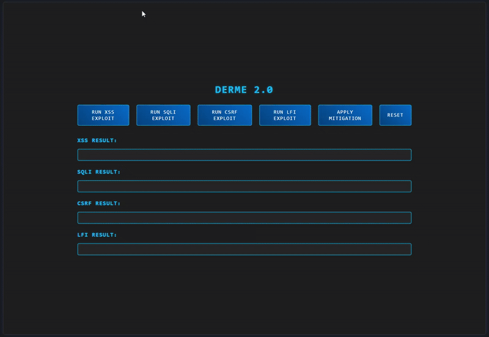
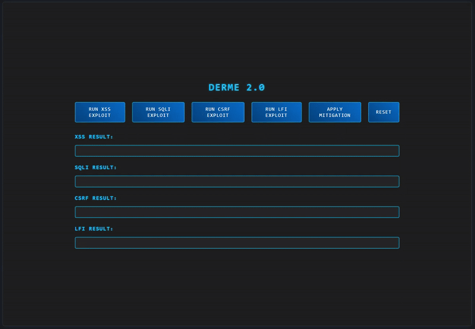
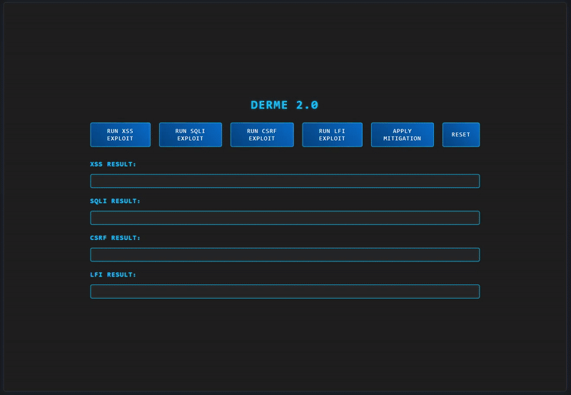

# DERME 2.0 - Dynamic Exploit Replay and Mitigation Engine

## Overview

DERME is a web security demonstration tool showcasing four common vulnerabilities: XSS, SQLi, CSRF, and LFI with real-time exploit execution and mitigation. Built to educate and impress, it simulates attacks on a vulnerable Flask app running in a Docker container, controlled via a sleek React frontend..

### Features

- **Exploits**:
  - **XSS**: Injects `<script>alert('XSS')</script>` into a welcome message.
  - **SQLi**: Bypasses login with `admin' --`.
  - **CSRF**: Transfers funds between users without authorization.
  - **LFI**: Attempts to include `secret.txt`, mitigated to a safe file.
- **Mitigation**: Toggle sanitization/parameterization to block exploits.
- **Reset**: Restore vulnerable state for replay.

### Tech Stack

- **Frontend**: React, TypeScript, Vite, CSS
- **Backend**: Flask (Python), SQLite in-memory DB
- **Containerization**: Docker
- **Orchestration**: Custom Flask engine (`exploit_engine.py`)

## Demo

### XSS Exploit



- Unmitigated: Script executes. Mitigated: Script is escaped.

### SQLi Exploit


- Unmitigated: Login succeeds. Mitigated: Login fails.

### CSRF Exploit



- Unmitigated: Funds transfer. Mitigated: Token required.

### LFI Exploit



- Unmitigated: File error. Mitigated: Safe file returned.

## Setup

1.  **Clone the Repo**:
    ```bash
        git clone https://github.com/cameronotoole44/DERME
        cd derme
    ```
2.  **Backend Setup**:

    - _Prerequisites_: Docker

    **Virtual Environment**

    ```bash
        # Linux/Mac

        cd backend/exploit_engine
        python3 -m venv venv
        source venv/bin/activate
        pip install -r requirements.txt
    ```

    ```bash
        # Windows (Command Prompt)

        cd backend\exploit_engine
        python -m venv venv
        venv\Scripts\activate
        pip install -r requirements.txt
    ```

    ```bash
        # Windows (Git Bash)

        cd backend/exploit_engine
        python -m venv venv
        source venv/Scripts/activate
        pip install -r requirements.txt
    ```

3.  **Start Backend**

    ```bash
        cd backend/vuln_app
        docker build -t vuln-app .
        cd ../exploit_engine
        python exploit_engine.py
    ```

4.  **Frontend**:
    ```bash
    cd frontend
    npm install
    npm run dev
    ```
5.  Open http://localhost:5173 and start the exploits!
