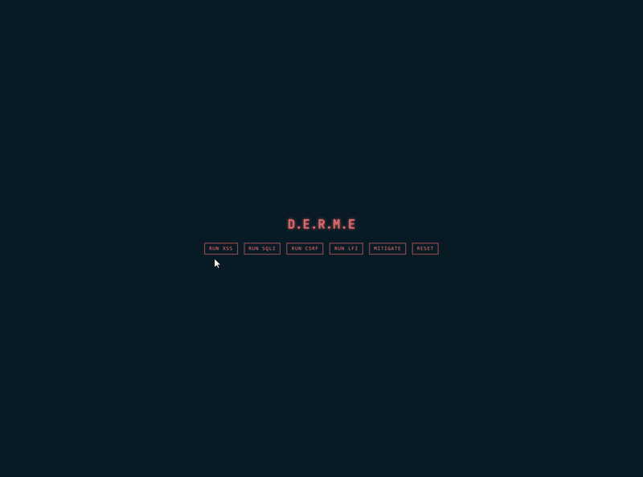

# D.E.R.M.E

**Dynamic Exploit Replay and Mitigation Engine**

A web security demonstration tool showcasing common vulnerabilities with real-time exploit execution and mitigation. Simulates attacks on a vulnerable Flask app running in Docker, controlled via a React frontend.

## Exploits

| Type | Attack | Description |
|------|--------|-------------|
| **XSS** | `<script>alert('XSS')</script>` | Reflected script injection |
| **SQLi** | `admin' --` | Authentication bypass |
| **CSRF** | Unauthorized transfer | Missing token validation |
| **LFI** | `../secret.txt` | Path traversal file read |

## Tech Stack

- **Frontend**: React, TypeScript, Vite
- **Backend**: Flask, SQLite (in-memory)
- **Container**: Docker (vuln_app)
- **Orchestration**: exploit_engine.py

## Architecture

```
┌─────────────┐      ┌──────────────────┐      ┌─────────────────┐
│   Frontend  │ ───▶ │  exploit_engine  │ ───▶ │    vuln_app     │
│  :5173      │      │     :5000        │      │  :5001 (Docker) │
└─────────────┘      └──────────────────┘      └─────────────────┘
```

## Setup

### Prerequisites

- Docker
- Node.js
- Python 3.x

### Backend

```bash
# Build vulnerable app container
cd backend/vuln_app
docker build -t vuln-app .

# Start exploit engine
cd ../exploit_engine
python3 -m venv venv
source venv/bin/activate  # Windows: venv\Scripts\activate
pip install -r requirements.txt
python exploit_engine.py
```

### Frontend

```bash
cd frontend
npm install
npm run dev
```

Open http://localhost:5173

## Demo

### Exploit Execution



### Mitigated Response


### Result Panels


## API

| Endpoint | Method | Description |
|----------|--------|-------------|
| `/exploits` | GET | List available exploits |
| `/exploit/<id>` | POST | Run exploit |
| `/status` | GET | Get mitigation state |
| `/mitigate/<type>` | POST | Apply mitigation |
| `/reset` | POST | Reset all mitigations |
